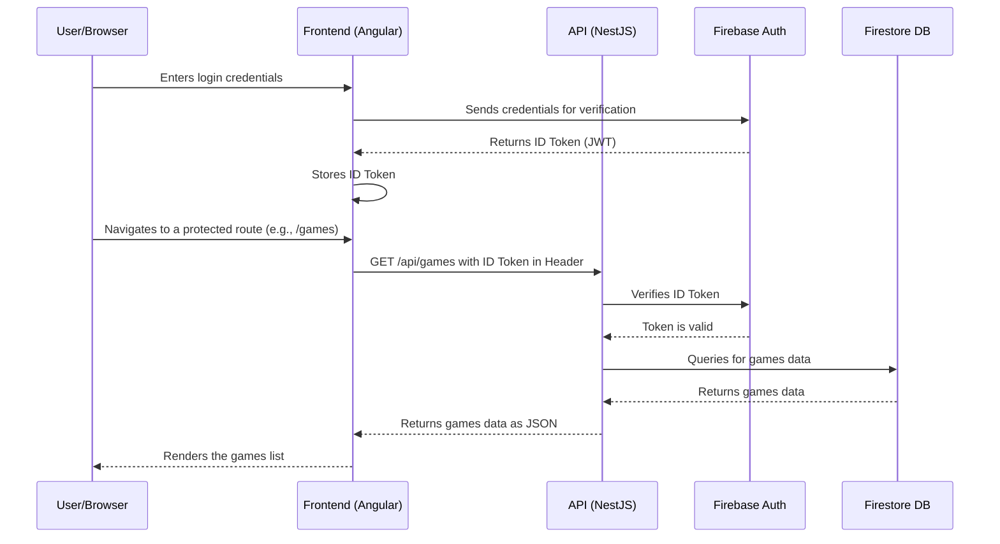

# NFL Pick 'Em Monorepo

This project is a full-stack NFL Pick 'Em application, managed as an Nx monorepo. It features:

- **Angular** frontend (UI)
- **NestJS** backend API
- Managed with [Nx](https://nx.dev/) for powerful monorepo tooling

## Application Architecture



## Getting Started

### TL;DR

To install dependencies and start both the API and UI in one step, run:

```bash
npm install && NODE_ENV=development GOOGLE_APPLICATION_CREDENTIALS="api/serviceAccountKey.json" nx run-many --target=serve --projects=api,frontend --parallel
```

### Prerequisites

- [Node.js](https://nodejs.org/) (v18+ recommended)
- [npm](https://www.npmjs.com/) (comes with Node.js)
- [Nx CLI](https://nx.dev/):
  ```bash
  npm install -g nx
  ```

### Install Dependencies

From the root of the repository:

```bash
npm install
```

## Running the Applications

You can run both the API and the UI simultaneously using Nx. This will start each in a separate process.

### Start Both API and UI

From the root directory, run:

```bash
NODE_ENV=development GOOGLE_APPLICATION_CREDENTIALS="api/serviceAccountKey.json" nx run-many --target=serve --projects=api,frontend --parallel
```

This will:

- Start the **NestJS API** (default: http://localhost:3000)
- Start the **Angular UI** (default: http://localhost:4200)

> **Tip:** You can also run each app individually if needed:

#### Run API only

```bash
NODE_ENV=development GOOGLE_APPLICATION_CREDENTIALS="api/serviceAccountKey.json" nx serve api
```

#### Run UI only

```bash
nx serve frontend
```

## Project Structure

- `api/` - NestJS backend
- `frontend/` - Angular frontend
- `libs/` - Shared libraries

## Contributing

Pull requests are welcome! For major changes, please open an issue first to discuss what you would like to change.

## License

This project is licensed under the MIT License.
